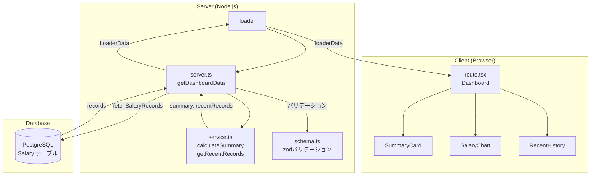
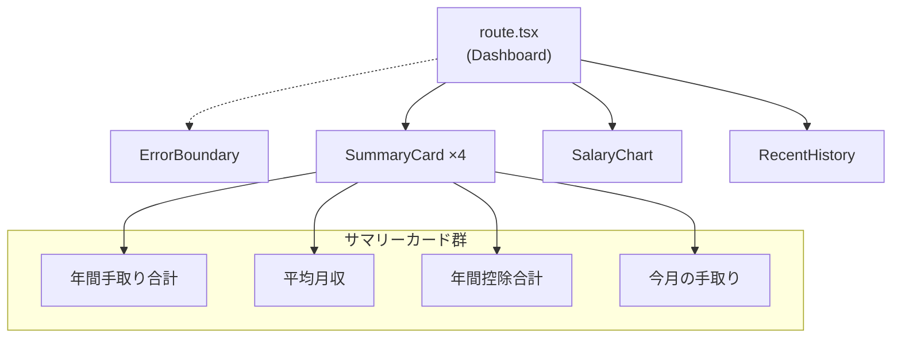

# ダッシュボード 設計書

> 自動生成日: 2025-12-12
> 対象ディレクトリ: `app/routes/dashboard`

## 1. 機能概要

給与データの概要を視覚的に表示するダッシュボード機能。\
ユーザーの給与サマリー（年間手取り、平均月収、控除合計）、月別給与推移チャート、直近の給与明細履歴を一覧表示する。

### ユースケース

- 年間の給与サマリーを確認する
- 月別の手取り推移をチャートで可視化する
- 残業時間の推移を折れ線グラフで確認する
- 直近の給与明細を一覧で確認する

## 2. ファイル構成

| ファイル                       | カテゴリ           | 説明                                                                                   |
| ------------------------------ | ------------------ | -------------------------------------------------------------------------------------- |
| `route.tsx`                    | UI層               | ダッシュボードのメインコンポーネント。loader関数でデータ取得し、子コンポーネントに配布 |
| `server.ts`                    | サーバー層         | DBからの給与レコード取得とzodバリデーション                                            |
| `service.ts`                   | ビジネスロジック層 | サマリー計算、直近レコード抽出などの純粋関数                                           |
| `schema.ts`                    | バリデーション     | zodスキーマと型定義（SalaryRecord, SummaryData, LoaderData）                           |
| `components/SummaryCard.tsx`   | 子コンポーネント   | サマリーカード（タイトル、値、アイコン、トレンド表示）                                 |
| `components/SalaryChart.tsx`   | 子コンポーネント   | 月別給与推移チャート（recharts使用）                                                   |
| `components/RecentHistory.tsx` | 子コンポーネント   | 直近給与明細のテーブル表示                                                             |

## 3. データフロー



## 4. 型定義

### スキーマ（schema.ts）

```typescript
// 給与記録スキーマ
export const salaryRecordSchema = z.object({
  id: z.string(),
  year: z.number(),
  month: z.number().min(1).max(12),

  // 勤怠
  extraOvertimeMinutes: z.number().nonnegative(),
  over60OvertimeMinutes: z.number().nonnegative(),
  nightOvertimeMinutes: z.number().nonnegative(),
  paidLeaveDays: z.number().nonnegative(),
  paidLeaveRemainingDays: z.number().nonnegative(),

  // 支給
  baseSalary: z.number().nonnegative(),
  fixedOvertimeAllowance: z.number().nonnegative(),
  overtimeAllowance: z.number().nonnegative(),
  // ... 他の手当
  totalEarnings: z.number().nonnegative(),

  // 控除
  healthInsurance: z.number().nonnegative(),
  pensionInsurance: z.number().nonnegative(),
  // ... 他の控除
  totalDeductions: z.number().nonnegative(),

  // 差引支給額
  netSalary: z.number(),
});

// サマリーデータスキーマ
export const summaryDataSchema = z.object({
  totalNetSalary: z.number(),
  averageNetSalary: z.number(),
  totalEarnings: z.number(),
  totalDeductions: z.number(),
  yearOverYearChange: z.number(),
});

// ローダーデータスキーマ
export const loaderDataSchema = z.object({
  summary: summaryDataSchema,
  monthlySalaries: z.array(salaryRecordSchema),
  recentRecords: z.array(salaryRecordSchema),
});

// 型定義（スキーマから推論）
export type SalaryRecord = z.infer<typeof salaryRecordSchema>;
export type SummaryData = z.infer<typeof summaryDataSchema>;
export type LoaderData = z.infer<typeof loaderDataSchema>;
```

### Props 型

| コンポーネント  | Props型                                                                                                    |
| --------------- | ---------------------------------------------------------------------------------------------------------- |
| `SummaryCard`   | `{ title: string; value: string; icon: React.ComponentType; trend?: "up" \| "down"; trendValue?: string }` |
| `SalaryChart`   | `{ data: MonthlySalary[] }`                                                                                |
| `RecentHistory` | `{ records: MonthlySalary[] }`                                                                             |

## 5. コンポーネント階層



## 6. DB操作

| 操作 | 関数名               | テーブル | 説明                           |
| ---- | -------------------- | -------- | ------------------------------ |
| READ | `fetchSalaryRecords` | Salary   | 全給与レコードを年月昇順で取得 |

### クエリ詳細

```typescript
await prisma.salary.findMany({
  orderBy: [{ year: "asc" }, { month: "asc" }],
});
```

## 7. 外部依存

### 共有モジュール

| モジュール               | 用途                                |
| ------------------------ | ----------------------------------- |
| `~/shared/lib/db.server` | Prismaクライアント（prisma）        |
| `~/shared/utils/format`  | `formatCurrency` - 金額フォーマット |

### 外部ライブラリ

| ライブラリ     | 用途                                                                           |
| -------------- | ------------------------------------------------------------------------------ |
| `react-router` | ルーティング、loader、data()、isRouteErrorResponse                             |
| `zod`          | スキーマバリデーション                                                         |
| `recharts`     | チャート描画（ComposedChart, Bar, Line, XAxis, YAxis, Tooltip, Legend）        |
| `lucide-react` | アイコン（TrendingUp, TrendingDown, Wallet, Calendar, Banknote, ArrowUpRight） |

## 8. テストカバレッジ

| ファイル                       | テストファイル                                | 状態 |
| ------------------------------ | --------------------------------------------- | ---- |
| `route.tsx`                    | `__tests__/route.test.tsx`                    | ✅   |
| `server.ts`                    | `__tests__/server.test.ts`                    | ✅   |
| `service.ts`                   | `__tests__/service.test.ts`                   | ✅   |
| `schema.ts`                    | `__tests__/schema.test.ts`                    | ✅   |
| `components/SummaryCard.tsx`   | `__tests__/components/SummaryCard.test.tsx`   | ✅   |
| `components/SalaryChart.tsx`   | `__tests__/components/SalaryChart.test.tsx`   | ✅   |
| `components/RecentHistory.tsx` | `__tests__/components/RecentHistory.test.tsx` | ✅   |

**共有モジュールのテスト**: `formatCurrency` のテストは `app/shared/utils/__tests__/format.test.ts` に配置

## 9. 設計上の特記事項

### データ変換

- **Decimal → number 変換**: Prismaから取得した `paidLeaveDays`, `paidLeaveRemainingDays` は `Decimal` 型のため、`Number()` で変換

### 前年比の計算

- 現在は仮の値（3.5%）を返却 {推測: 将来的に前年データとの比較ロジックを実装予定}

```typescript
// service.ts
const yearOverYearChange = 3.5; // 前年比は仮の値
```

### エラーハンドリング

- **zodバリデーション失敗時**: HTTP 500 エラーを返却
- **ErrorBoundary**: RouteErrorResponse とその他のエラーを分岐処理

## 10. 関連ドキュメント

- [React Router v7 ドキュメント](https://reactrouter.com/)
- [Recharts ドキュメント](https://recharts.org/)
- [Zod ドキュメント](https://zod.dev/)
- [プロジェクトルール](/.claude/rules/)
