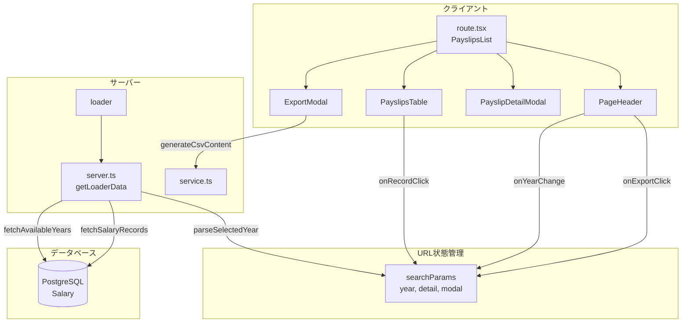
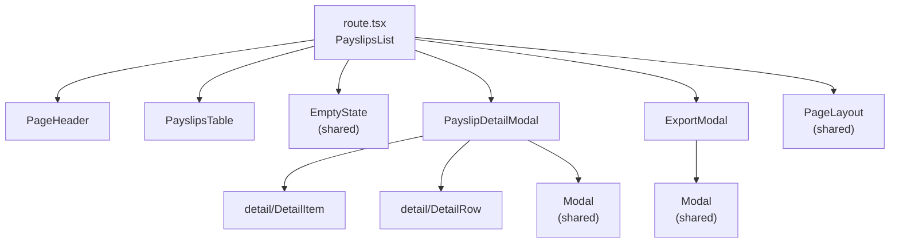

# 給与明細一覧 設計書

> 自動生成日: 2025-12-15
> 対象ディレクトリ: `app/routes/payslips/(index)`

## 1. 機能概要

給与明細一覧ページ。ユーザーの過去の給与明細を一覧表示し、詳細確認およびCSVエクスポート機能を提供する。

### ユースケース

- 年別または全期間の給与明細一覧を表示する
- 給与明細の詳細（勤怠情報、支給、控除）を確認する
- 給与データをCSV形式でエクスポートする（全件/年指定/月指定）

## 2. ファイル構成

| ファイル                            | カテゴリ         | 説明                                           |
| ----------------------------------- | ---------------- | ---------------------------------------------- |
| `route.tsx`                         | UI層             | メインコンポーネント、ルーティング・状態管理   |
| `server.ts`                         | サーバー層       | Loader用データ取得、DBアクセス                 |
| `service.ts`                        | ビジネスロジック | CSV生成、時間フォーマット、レコードフィルタ    |
| `schema.ts`                         | バリデーション   | Zodスキーマ、型定義、メッセージ定数            |
| `types.ts`                          | 型定義           | コンポーネントのProps型定義                    |
| `components/PageHeader.tsx`         | 子コンポーネント | ページヘッダー（タイトル、年選択、出力ボタン） |
| `components/PayslipsTable.tsx`      | 子コンポーネント | 給与明細一覧テーブル                           |
| `components/PayslipDetailModal.tsx` | 子コンポーネント | 給与明細詳細モーダル                           |
| `components/ExportModal.tsx`        | 子コンポーネント | CSV出力モーダル                                |
| `components/detail/DetailItem.tsx`  | 子コンポーネント | 詳細表示用カード型アイテム                     |
| `components/detail/DetailRow.tsx`   | 子コンポーネント | 詳細表示用行コンポーネント                     |

## 3. データフロー



## 4. 型定義

### スキーマ（schema.ts）

```typescript
// 給与レコードスキーマ
export const salaryRecordSchema = z.object({
  id: z.string(),
  year: z.number(),
  month: z.number().min(1).max(12),
  // 勤怠
  extraOvertimeMinutes: z.number().nonnegative(),
  over60OvertimeMinutes: z.number().nonnegative(),
  nightOvertimeMinutes: z.number().nonnegative(),
  paidLeaveDays: z.number().nonnegative(),
  paidLeaveRemainingDays: z.number().nonnegative(),
  // 支給
  baseSalary: z.number().nonnegative(),
  fixedOvertimeAllowance: z.number().nonnegative(),
  overtimeAllowance: z.number().nonnegative(),
  over60OvertimeAllowance: z.number().nonnegative(),
  nightAllowance: z.number().nonnegative(),
  specialAllowance: z.number().nonnegative(),
  expenseReimbursement: z.number().nonnegative(),
  commuteAllowance: z.number().nonnegative(),
  stockIncentive: z.number().nonnegative(),
  totalEarnings: z.number().nonnegative(),
  // 控除
  healthInsurance: z.number().nonnegative(),
  pensionInsurance: z.number().nonnegative(),
  employmentInsurance: z.number().nonnegative(),
  residentTax: z.number().nonnegative(),
  incomeTax: z.number().nonnegative(),
  stockContribution: z.number().nonnegative(),
  totalDeductions: z.number().nonnegative(),
  // 差引
  netSalary: z.number(),
});

export type SalaryRecord = z.infer<typeof salaryRecordSchema>;

// Loaderデータ型
export type LoaderData = {
  records: SalaryRecord[];
  selectedYear: number | "all";
  availableYears: number[];
};

// エクスポート範囲型
export type ExportRangeType = "all" | "year" | "month";
```

### Props 型（types.ts）

| コンポーネント       | Props型                        | 主要プロパティ                                       |
| -------------------- | ------------------------------ | ---------------------------------------------------- |
| `PageHeader`         | `PageHeaderProps`              | recordsCount, selectedYear, availableYears, handlers |
| `PayslipsTable`      | `PayslipsTableProps`           | records, isAllYears, onRecordClick                   |
| `PayslipDetailModal` | `PayslipDetailModalProps`      | record, onClose                                      |
| `ExportModal`        | `ExportModalProps`             | isAllYears, selectedYear, records, onClose           |
| `DetailItem`         | `{ label, value }`             | label, value                                         |
| `DetailRow`          | `{ label, value, highlight? }` | label, value, highlight                              |

## 5. コンポーネント階層



## 6. DB操作

| 操作 | 関数名                | テーブル | 説明                                              |
| ---- | --------------------- | -------- | ------------------------------------------------- |
| READ | `fetchAvailableYears` | Salary   | 利用可能な年のリストを取得（groupBy → year desc） |
| READ | `fetchSalaryRecords`  | Salary   | 給与レコードを取得（年指定または全件）            |

### クエリ詳細

```typescript
// 利用可能な年を取得
prisma.salary.groupBy({
  by: ["year"],
  orderBy: { year: "desc" },
});

// 給与レコード取得（全件）
prisma.salary.findMany({
  where: {},
  orderBy: [{ year: "desc" }, { month: "desc" }],
});

// 給与レコード取得（年指定）
prisma.salary.findMany({
  where: { year: selectedYear },
  orderBy: { month: "asc" },
});
```

## 7. 外部依存

### 共有モジュール

| インポート元                             | 使用箇所                          |
| ---------------------------------------- | --------------------------------- |
| `~/shared/lib/db.server`                 | server.ts (prisma)                |
| `~/shared/components/EmptyState`         | route.tsx                         |
| `~/shared/components/PageLayout`         | route.tsx                         |
| `~/shared/components/RouteErrorBoundary` | route.tsx                         |
| `~/shared/components/Modal`              | PayslipDetailModal, ExportModal   |
| `~/shared/utils/format`                  | PayslipsTable, PayslipDetailModal |

### 外部ライブラリ

| ライブラリ     | 使用箇所                                               |
| -------------- | ------------------------------------------------------ |
| `react-router` | route.tsx (useSearchParams), server.ts (data)          |
| `zod`          | schema.ts, server.ts                                   |
| `lucide-react` | PageHeader (ChevronDown, FileSpreadsheet), ExportModal |

## 8. テストカバレッジ

| ファイル             | テストファイル                                     | 状態 |
| -------------------- | -------------------------------------------------- | ---- |
| `route.tsx`          | `__tests__/route.test.tsx`                         | ✅   |
| `server.ts`          | `__tests__/server.test.ts`                         | ✅   |
| `service.ts`         | `__tests__/service.test.ts`                        | ✅   |
| `schema.ts`          | `__tests__/schema.test.ts`                         | ✅   |
| `PageHeader`         | `__tests__/components/PageHeader.test.tsx`         | ✅   |
| `PayslipsTable`      | `__tests__/components/PayslipsTable.test.tsx`      | ✅   |
| `PayslipDetailModal` | `__tests__/components/PayslipDetailModal.test.tsx` | ✅   |
| `ExportModal`        | `__tests__/components/ExportModal.test.tsx`        | ✅   |
| `DetailItem`         | `__tests__/components/detail/DetailItem.test.tsx`  | ✅   |
| `DetailRow`          | `__tests__/components/detail/DetailRow.test.tsx`   | ✅   |

## 9. 状態管理

URLパラメータによる状態管理を採用：

| パラメータ | 説明                    | 例                        |
| ---------- | ----------------------- | ------------------------- |
| `year`     | 表示年（数値 or "all"） | `?year=2024`, `?year=all` |
| `detail`   | 詳細表示中のレコードID  | `?detail=xxx-xxx-xxx`     |
| `modal`    | 表示中のモーダル種別    | `?modal=export`           |

## 10. 関連ドキュメント

- [React Router v7 ドキュメント](https://reactrouter.com/)
- [Zod ドキュメント](https://zod.dev/)
- [プロジェクトルール](/.claude/rules/)
  - [型管理ルール](/.claude/rules/type-management.md)
  - [バリデーションルール](/.claude/rules/validation.md)
  - [レイヤー依存関係ルール](/.claude/rules/layer-dependencies.md)
