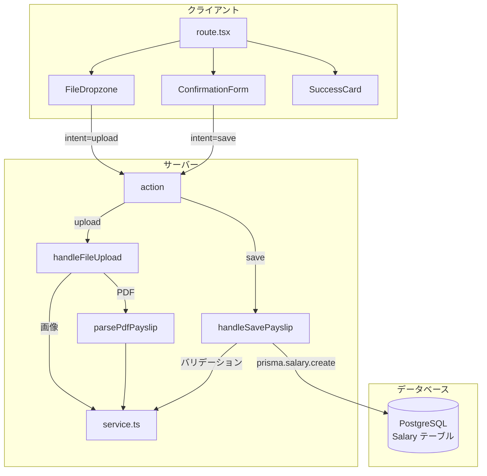
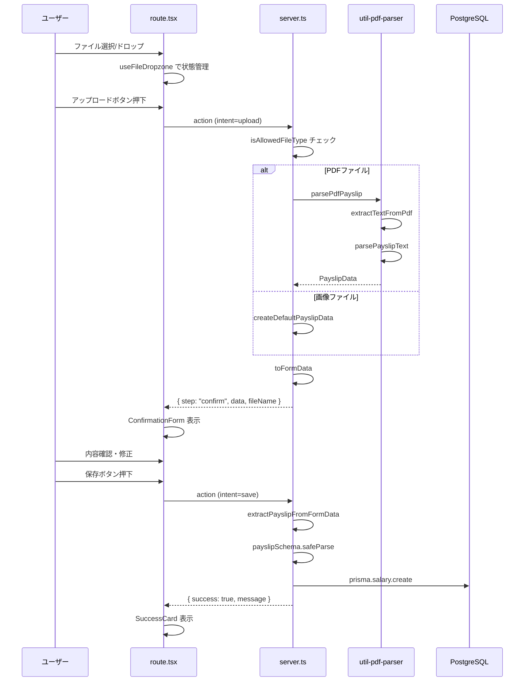
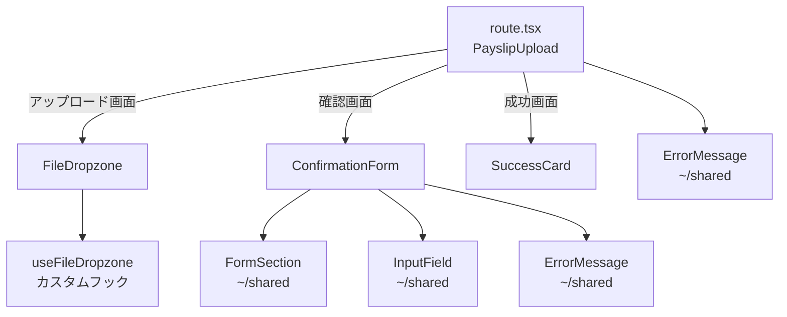
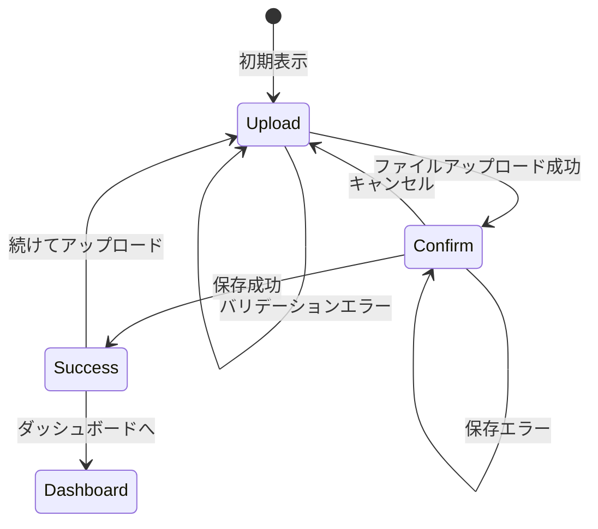

# 給与明細アップロード機能 設計書

> 自動生成日: 2025-12-12
> 対象ディレクトリ: `app/routes/payslips/upload`

## 1. 機能概要

給与明細のPDFまたは画像ファイルをアップロードし、内容を解析・確認・編集してデータベースに保存する機能。PDFファイルはテキスト解析により自動でフィールドを抽出し、ユーザーが確認・修正後に保存できる。

### ユースケース

- ユーザーが給与明細のPDFファイルをアップロードする
- ユーザーが給与明細の画像ファイル（PNG, JPG）をアップロードする
- アップロードしたファイルから抽出されたデータを確認・修正する
- 確認したデータをデータベースに保存する

## 2. ファイル構成

| ファイル                          | カテゴリ           | 説明                                                                                                                        |
| --------------------------------- | ------------------ | --------------------------------------------------------------------------------------------------------------------------- |
| `route.tsx`                       | UI層               | メインルートコンポーネント。action関数でファイルアップロードと保存を処理。3つの画面状態（アップロード/確認/成功）を切り替え |
| `server.ts`                       | サーバー層         | ファイルアップロード処理（`handleFileUpload`）と保存処理（`handleSavePayslip`）を提供。DBへの永続化を担当                   |
| `service.ts`                      | ビジネスロジック層 | ファイル形式チェック、デフォルトデータ生成、FormDataからのデータ抽出、時間文字列の変換などのユーティリティ                  |
| `schema.ts`                       | バリデーション     | Zodスキーマ定義、型定義（`PayslipData`, `PayslipFormData`, `ActionData`）、フィールド定義、PDFラベルマッピング              |
| `util-pdf-parser.server.ts`       | ユーティリティ     | PDFテキスト抽出と給与明細データへのパース処理                                                                               |
| `components/ConfirmationForm.tsx` | 子コンポーネント   | 給与明細の確認・編集フォーム。勤怠/支給/控除のセクションに分けて表示                                                        |
| `components/FileDropzone.tsx`     | 子コンポーネント   | ファイルドラッグ&ドロップエリア。カスタムフック`useFileDropzone`とUIコンポーネントを提供                                    |
| `components/SuccessCard.tsx`      | 子コンポーネント   | 保存成功時のカード表示                                                                                                      |

## 3. データフロー



### 処理フロー詳細



## 4. 型定義

### スキーマ（schema.ts）

```typescript
// 許可されるファイル形式
export const ALLOWED_FILE_TYPES = [
  "application/pdf",
  "image/png",
  "image/jpeg",
  "image/jpg",
] as const;

// 給与明細バリデーションスキーマ
export const payslipSchema = z.object({
  // 基本情報
  year: z.coerce.number().min(2000).max(2100),
  month: z.coerce.number().min(1).max(12),

  // 勤怠
  extraOvertimeMinutes: z.coerce.number().min(0),
  over60OvertimeMinutes: z.coerce.number().min(0),
  nightOvertimeMinutes: z.coerce.number().min(0),
  paidLeaveDays: z.coerce.number().min(0),
  paidLeaveRemainingDays: z.coerce.number().min(0),

  // 支給（10フィールド）
  baseSalary: z.coerce.number().min(0),
  // ... 他の支給フィールド
  totalEarnings: z.coerce.number().min(0),

  // 控除（7フィールド）
  healthInsurance: z.coerce.number().min(0),
  // ... 他の控除フィールド
  totalDeductions: z.coerce.number().min(0),

  // 差引支給額
  netSalary: z.coerce.number().min(0),
});

// action の結果型（判別可能なユニオン型）
export type ActionData =
  | { success: true; message: string }
  | { success: false; error: string }
  | { step: "confirm"; data: PayslipFormData; fileName: string };
```

### Props 型

| コンポーネント     | Props型                                                                                                                                                                          |
| ------------------ | -------------------------------------------------------------------------------------------------------------------------------------------------------------------------------- |
| `ConfirmationForm` | `{ data: PayslipFormData; fileName: string; isSubmitting: boolean; actionData: ActionData }`                                                                                     |
| `FileDropzone`     | `{ dragActive: boolean; selectedFile: File \| null; previewUrl: string \| null; fileInputRef: RefObject<HTMLInputElement \| null>; onDrag; onDrop; onInputChange; onClearFile }` |
| `SuccessCard`      | `{ message: string }`                                                                                                                                                            |

## 5. コンポーネント階層



### 画面状態遷移



## 6. DB操作

| 操作   | 関数名                  | テーブル | 説明                     |
| ------ | ----------------------- | -------- | ------------------------ |
| CREATE | `savePayslipToDatabase` | `Salary` | 給与明細データを新規作成 |

### 保存されるフィールド

- 基本情報: `year`, `month`
- 勤怠: `extraOvertimeMinutes`, `over60OvertimeMinutes`, `nightOvertimeMinutes`, `paidLeaveDays`, `paidLeaveRemainingDays`
- 支給: `baseSalary`, `fixedOvertimeAllowance`, `overtimeAllowance`, `over60OvertimeAllowance`, `nightAllowance`, `specialAllowance`, `expenseReimbursement`, `commuteAllowance`, `stockIncentive`, `totalEarnings`
- 控除: `healthInsurance`, `pensionInsurance`, `employmentInsurance`, `residentTax`, `incomeTax`, `stockContribution`, `totalDeductions`
- 差引支給額: `netSalary`

## 7. 外部依存

### 共有モジュール

| インポート元                       | 使用箇所                        | 説明                                      |
| ---------------------------------- | ------------------------------- | ----------------------------------------- |
| `~/shared/lib/db.server`           | server.ts                       | Prisma クライアント                       |
| `~/shared/utils/format`            | server.ts                       | `formatNumberWithCommas` 金額フォーマット |
| `~/shared/components/ErrorMessage` | route.tsx, ConfirmationForm.tsx | エラーメッセージ表示                      |
| `~/shared/components/FormSection`  | ConfirmationForm.tsx            | フォームセクション                        |
| `~/shared/components/InputField`   | ConfirmationForm.tsx            | 入力フィールド                            |

### 外部ライブラリ

| ライブラリ     | 使用箇所                        | 用途                                            |
| -------------- | ------------------------------- | ----------------------------------------------- |
| `react-router` | route.tsx, ConfirmationForm.tsx | Form, useActionData, useNavigation              |
| `lucide-react` | 各コンポーネント                | アイコン（Upload, Loader2, FileText, X, Check） |
| `zod`          | schema.ts                       | バリデーションスキーマ                          |
| `pdf-parse`    | util-pdf-parser.server.ts       | PDF テキスト抽出                                |

## 8. テストカバレッジ

| ファイル                          | テストファイル                                   | 状態 |
| --------------------------------- | ------------------------------------------------ | ---- |
| `server.ts`                       | `__tests__/server.test.ts`                       | ✅   |
| `service.ts`                      | `__tests__/service.test.ts`                      | ✅   |
| `schema.ts`                       | `__tests__/schema.test.ts`                       | ✅   |
| `util-pdf-parser.server.ts`       | `__tests__/util-pdf-parser.server.test.ts`       | ✅   |
| `components/SuccessCard.tsx`      | `__tests__/components/SuccessCard.test.tsx`      | ✅   |
| `components/ConfirmationForm.tsx` | `__tests__/components/ConfirmationForm.test.tsx` | ✅   |
| `components/FileDropzone.tsx`     | `__tests__/components/FileDropzone.test.tsx`     | ✅   |
| `route.tsx`                       | `__tests__/route.test.tsx`                       | ✅   |

## 9. 特記事項

### PDF解析の仕組み

1. `pdf-parse` ライブラリでPDFからテキストを抽出
2. `PDF_LABEL_MAPPINGS` を使用してラベルから値をマッピング
3. 年月は「2025(令和07)年11月25日支給分」形式から抽出
4. 合計金額は連続した大きな金額値から推定

### 画面状態管理

- `actionData` の型に応じて表示画面を切り替え
  - `step === "confirm"`: 確認画面
  - `success === true`: 成功画面
  - それ以外: アップロード画面

### フォームデータ変換

- DB保存時: 分単位（数値）、金額（数値）
- UI表示時: 時間（HH:MM形式）、金額（カンマ区切り文字列）

## 10. 関連ドキュメント

- [React Router v7 ドキュメント](https://reactrouter.com/)
- [Zod ドキュメント](https://zod.dev/)
- [pdf-parse ドキュメント](https://www.npmjs.com/package/pdf-parse)
- [プロジェクトルール](/.claude/rules/)
