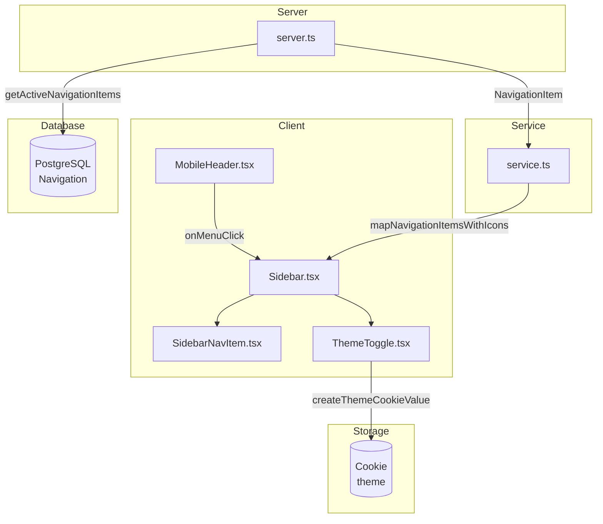
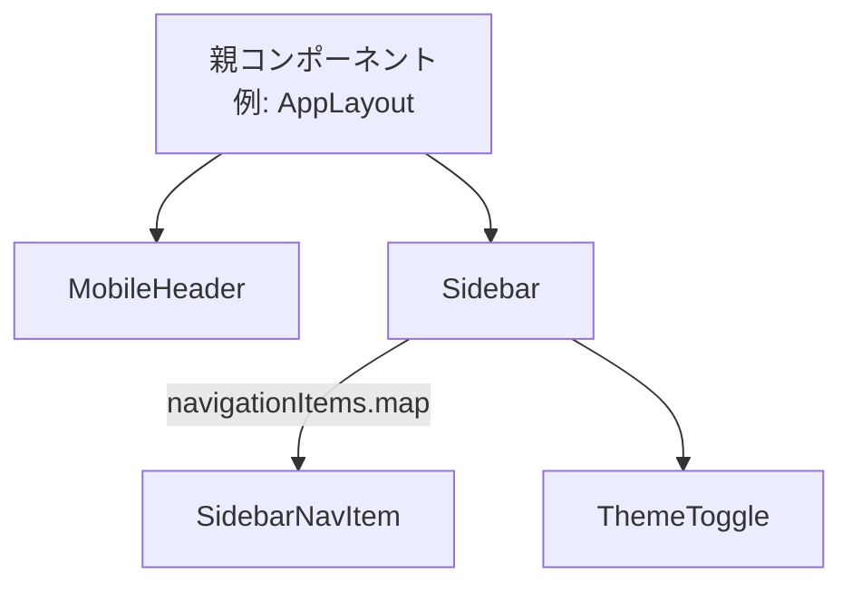

# Sidebar レイアウト 設計書

> 自動生成日: 2025-12-12
> 対象ディレクトリ: `app/shared/layout/sidebar`

## 1. 機能概要

アプリケーション全体で共有されるサイドバーナビゲーションコンポーネント。レスポンシブ対応でデスクトップでは常時表示、モバイルではハンバーガーメニューから開閉可能。テーマ切り替え（ライト/ダーク）機能も内包。

### ユースケース

- ページ間のナビゲーション移動
- ライト/ダークテーマの切り替え
- モバイルでのナビゲーションメニュー開閉

## 2. ファイル構成

| ファイル                       | カテゴリ           | 説明                                                 |
| ------------------------------ | ------------------ | ---------------------------------------------------- |
| `Sidebar.tsx`                  | UI層               | メインのサイドバーコンポーネント。開閉状態やキーボード操作を管理 |
| `server.ts`                    | サーバー層         | Prisma を使用したナビゲーション項目の取得            |
| `service.ts`                   | ビジネスロジック層 | アイコンマッピング、テーマ切り替えロジック           |
| `schema.ts`                    | バリデーション     | テーマ・ナビゲーション項目の型定義と Zod スキーマ    |
| `components/MobileHeader.tsx`  | 子コンポーネント   | モバイル用固定ヘッダー（ハンバーガーメニューボタン） |
| `components/SidebarNavItem.tsx`| 子コンポーネント   | 個別ナビゲーション項目（NavLink ベース）             |
| `components/ThemeToggle.tsx`   | 子コンポーネント   | テーマ切り替えトグルボタン                           |

## 3. データフロー



## 4. 型定義

### スキーマ（schema.ts）

```typescript
// テーマ
export const themeSchema = z.enum(["light", "dark"]);
export type Theme = z.infer<typeof themeSchema>;

// ナビゲーション項目（DB由来）
export const navigationItemSchema = z.object({
  id: z.string(),
  path: z.string(),
  label: z.string(),
  iconName: z.string(),
  sortOrder: z.number(),
  isActive: z.boolean(),
});
export type NavigationItem = z.infer<typeof navigationItemSchema>;

// アイコン付きナビゲーション項目（UI用）
export type NavigationItemWithIcon = NavigationItem & {
  icon: ComponentType<{ className?: string }>;
};
```

### Props 型

| コンポーネント     | Props 型              | プロパティ                                                    |
| ------------------ | --------------------- | ------------------------------------------------------------- |
| `Sidebar`          | `SidebarProps`        | `isOpen`, `onClose`, `initialTheme`, `navigationItems`        |
| `MobileHeader`     | `MobileHeaderProps`   | `onMenuClick`                                                 |
| `SidebarNavItem`   | `SidebarNavItemProps` | `item: NavigationItemWithIcon`, `onClick?`                    |
| `ThemeToggle`      | `ThemeToggleProps`    | `initialTheme: Theme`                                         |

## 5. コンポーネント階層



## 6. DB操作

| 操作   | 関数名                     | テーブル     | 説明                                         |
| ------ | -------------------------- | ------------ | -------------------------------------------- |
| READ   | `getActiveNavigationItems` | `Navigation` | 有効なナビゲーション項目を sortOrder 順に取得 |
| READ   | `getAllNavigationItems`    | `Navigation` | 全ナビゲーション項目を取得（管理用）          |

## 7. 外部依存

### 共有モジュール

- `~/shared/lib/db.server` - Prisma クライアント

### 外部ライブラリ

| ライブラリ       | 用途                                           |
| ---------------- | ---------------------------------------------- |
| `react`          | `useState`, `useEffect` フック                 |
| `react-router`   | `NavLink` コンポーネント                       |
| `lucide-react`   | アイコン（X, Menu, Moon, Sun, etc.）           |
| `zod`            | スキーマ定義・バリデーション                   |

### lucide-react アイコン使用一覧

| アイコン          | 使用箇所                   |
| ----------------- | -------------------------- |
| `X`               | Sidebar（閉じるボタン）    |
| `Menu`            | MobileHeader（開くボタン） |
| `Moon`            | ThemeToggle（ダークモード）|
| `Sun`             | ThemeToggle（ライトモード）|
| `LayoutDashboard` | service.ts（アイコンマップ）|
| `Upload`          | service.ts（アイコンマップ）|
| `Settings`        | service.ts（アイコンマップ）|
| `Home`            | service.ts（アイコンマップ）|
| `FileText`        | service.ts（アイコンマップ・デフォルト）|
| `BarChart`        | service.ts（アイコンマップ）|
| `Users`           | service.ts（アイコンマップ）|

## 8. テストカバレッジ

| ファイル               | テストファイル                                 | 状態 |
| ---------------------- | ---------------------------------------------- | ---- |
| `Sidebar.tsx`          | `__tests__/Sidebar.test.tsx`                   | ✅   |
| `schema.ts`            | `__tests__/schema.test.ts`                     | ✅   |
| `server.ts`            | `__tests__/server.test.ts`                     | ✅   |
| `service.ts`           | `__tests__/service.test.ts`                    | ✅   |
| `MobileHeader.tsx`     | `__tests__/components/MobileHeader.test.tsx`   | ✅   |
| `SidebarNavItem.tsx`   | `__tests__/components/SidebarNavItem.test.tsx` | ✅   |
| `ThemeToggle.tsx`      | `__tests__/components/ThemeToggle.test.tsx`    | ✅   |

## 9. アクセシビリティ対応

| 要素                   | 対応内容                                       |
| ---------------------- | ---------------------------------------------- |
| サイドバー             | `aria-label="メインナビゲーション"`            |
| 閉じるボタン           | `aria-label="サイドバーを閉じる"`              |
| メニュー開くボタン     | `aria-label="メニューを開く"`                  |
| テーマ切り替え         | `aria-label="Switch to {mode} mode"`           |
| オーバーレイ           | `aria-hidden="true"`                           |
| ESCキー対応            | サイドバーが開いている時に ESC で閉じる        |

## 10. レスポンシブ対応

| 画面サイズ      | 動作                                                |
| --------------- | --------------------------------------------------- |
| デスクトップ (lg+) | サイドバー常時表示、MobileHeader 非表示             |
| モバイル (< lg) | サイドバー非表示（スライドイン）、MobileHeader 表示 |

### ブレークポイント
- `lg` (1024px): デスクトップ/モバイル切り替え

## 11. 関連ドキュメント

- [React Router v7 NavLink](https://reactrouter.com/components/nav-link)
- [Tailwind CSS v4 Documentation](https://tailwindcss.com/docs)
- [Lucide Icons](https://lucide.dev/icons/)
- [Zod Documentation](https://zod.dev/)
- [プロジェクトルール](/.claude/rules/)
